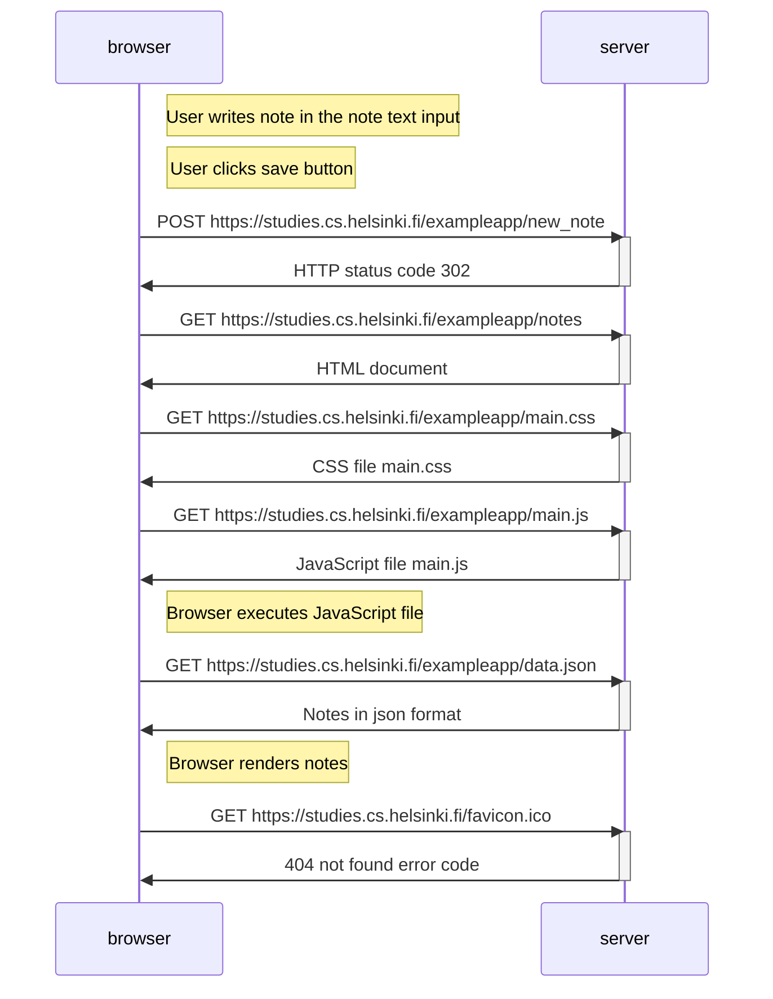

```mermaid

sequenceDiagram
  participant browser
  participant server

  Note right of browser: User writes note in the note text input
  Note right of browser: User clicks save button

  browser->>server: POST https://studies.cs.helsinki.fi/exampleapp/new_note
  activate server
  server->>browser: HTTP status code 302
  deactivate server
  
  browser->>server: GET https://studies.cs.helsinki.fi/exampleapp/notes
  activate server
  server->>browser: HTML document
  deactivate server
  
  browser->>server: GET https://studies.cs.helsinki.fi/exampleapp/main.css
  activate server
  server->>browser: CSS file main.css
  deactivate server
  
  browser->>server: GET https://studies.cs.helsinki.fi/exampleapp/main.js
  activate server
  server->>browser: JavaScript file main.js
  deactivate server

  Note right of browser: Browser executes JavaScript file

  browser->>server: GET https://studies.cs.helsinki.fi/exampleapp/data.json
  activate server
  server->>browser: Notes in json format
  deactivate server

  Note right of browser: Browser renders notes

  browser->>server: GET https://studies.cs.helsinki.fi/favicon.ico
  activate server
  server->>browser: 404 not found error code
  deactivate server

```
