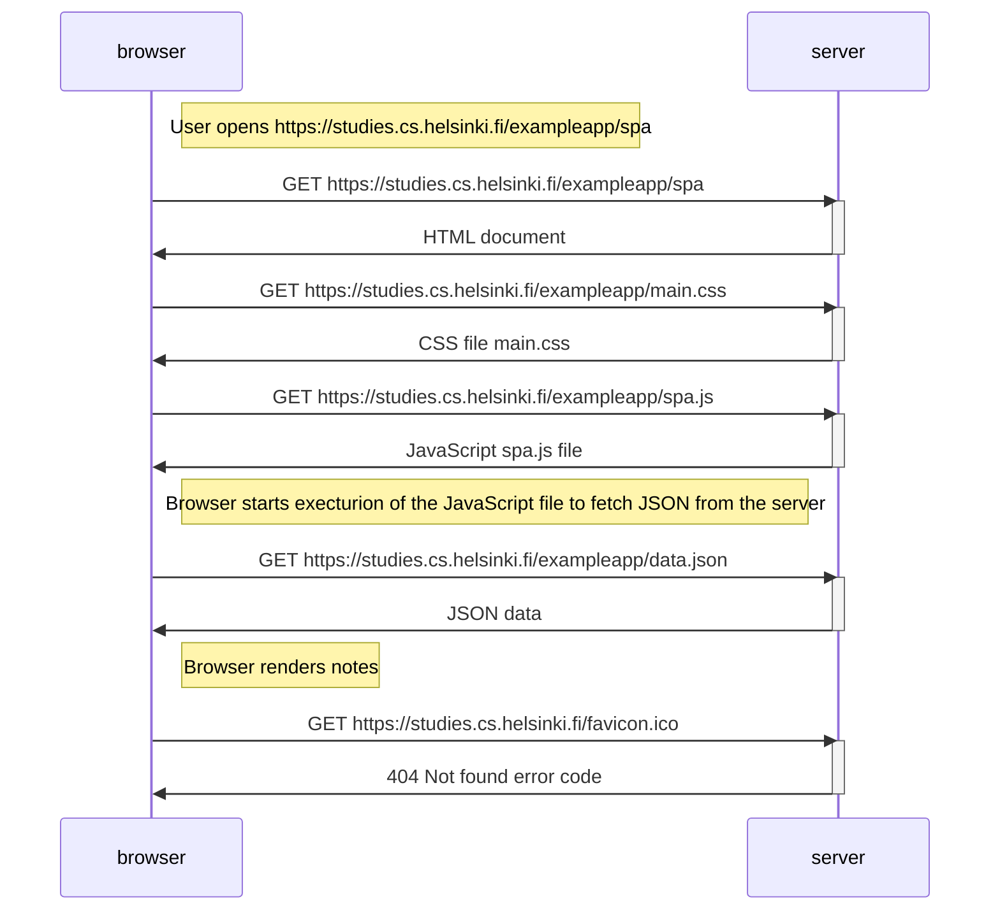

```mermaid

sequenceDiagram
participant browser
participant server

Note right of browser: User opens https://studies.cs.helsinki.fi/exampleapp/spa

browser->>server: GET https://studies.cs.helsinki.fi/exampleapp/spa
activate server
server->>browser: HTML document
deactivate server

browser->>server: GET https://studies.cs.helsinki.fi/exampleapp/main.css
activate server
server->>browser: CSS file main.css
deactivate server

browser->>server: GET https://studies.cs.helsinki.fi/exampleapp/spa.js
activate server
server->>browser: JavaScript spa.js file
deactivate server

Note right of browser: Browser starts execturion of the JavaScript file to fetch JSON from the server

browser->>server: GET https://studies.cs.helsinki.fi/exampleapp/data.json
activate server
server->>browser: JSON data
deactivate server

Note right of browser: Browser renders notes

browser->>server: GET https://studies.cs.helsinki.fi/favicon.ico
activate server
server->>browser: 404 Not found error code
deactivate server

```
