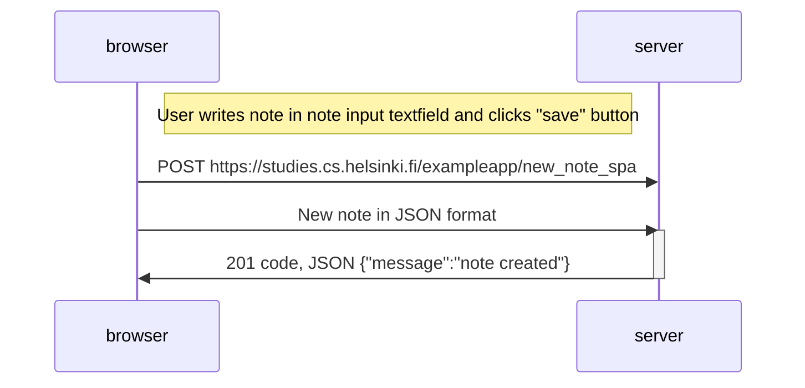

```mermaid

sequenceDiagram

participant browser
participant server

Note right of browser: User writes note in note input textfield and clicks "save" button

browser->>server: POST https://studies.cs.helsinki.fi/exampleapp/new_note_spa
browser->>server: New note in JSON format
activate server
server->>browser: 201 code, JSON {"message":"note created"}
deactivate server

```
